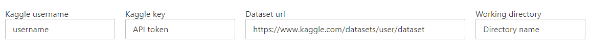
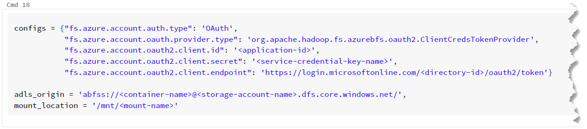

# A brief context

This was a pet project I developed during my Data Science & Business Analytics post-graduate degree.

At the time we were asked to develop a full study on a dataset of our choosing, with the following checklist:

1.  Design a DW for you data,
2.  Build the ETL process,
3.  Generate a business semantic model from your DW,
4.  Create relevant analytics dashboards from your semantic model,
5.  Apply a simple machine learning model to your data.

This project came in `step 2.`, where I decided to download my dataset from Kaggle into a given ADLS account using Databricks.

# About the notebook

This notebook was developed in `Shell` and `Python/Pyspark`, and it's sectioned with several `markdown` cells that introduce the main idea for their following code.

-   `Shell` is used to download the dataset and to work on and organize the filesystem.
-   `Python/Pyspark` code is responsible for the widgets, mount and files' copy into the data lake (ADLS).

A simple UI was created, using text widgets, so a user friendlier approach, with no in depth knowledge of the code, could be taken. For this, the first coded cell **(`cell 3`) needs to be ran, separately, first**.

This cell will create the widget UI, as depicted bellow:

-   `Kaggle username` - Insert your Kaggle account username.
-   `Kaggle key` - Refers to the Kaggle API token, created on your Kaggle account[^readme-1].
-   `Dataset url` - Copy the complete browsers' url from your selected dataset's page.
-   `Working directory` - Chose a name for the folder you want to have your data stored in (in both cluster's driver[^readme-2] and ADLS).

Finally, `cell 18` will need to be edited for each person. This cell is responsible for setting the mount point that connects Databricks to the ADLS service and the code wrapped in `<>` will need to be adjusted for each person/project.[^readme-3]

[^readme-1]: See the complete information about this key and how to get it [here](https://github.com/Kaggle/Kaggle-api#api-credentials).

[^readme-2]: Since I am using the community edition there is no problem with keeping a folder with the data on the driver (it's all temporary anyways), however, if you want to delete this folder and all data, from the cluster's driver, you can just add a new cell at the end and paste this code: `%sh rm /Databricks/driver/$ddir/ -rf`

[^readme-3]: This connection was developed for a `Gen 2` storage account. More information about this setup/code can be found [here](https://docs.databricks.com/data/data-sources/azure/azure-storage.html).
